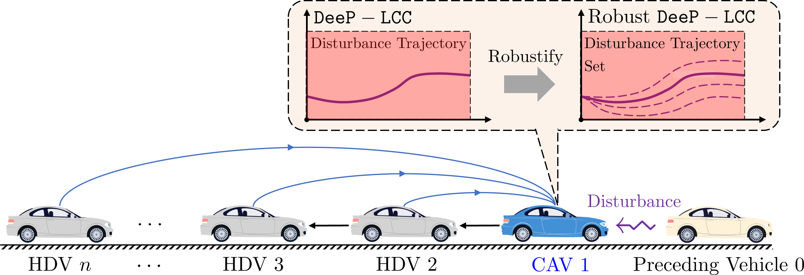

# Robust DeeP-LCC
In this project, we present a robust DeeP-LCC for control of the Connected and Autonomous Vehicles(CAVs) in CF-LCC system. This repository contains the MATLAB scripts for reproducing the experiments in our paper which can be found [here](https://arxiv.org/abs/2310.00509).

## Robust Data-EnablEd Predictive Leading Cruise Control(Robust DeeP-LCC)
DeeP-LCC is a data-driven predictive control strategy for CAVs in mixed traffic, where human-driven vehicles (HDVs) also exist. It aims to deal with unknown nonlinear car-following behaviors of HDVs and has been validated in real world small-
scale experiments. However, it assumes that the disturbance from the preceding vehicle will be **zero** in the future, which is impractical for real systems. Thus, this assumption introduces safety concerns and degrades its control performance.

To address this problem, we develop the robust DeeP-LCC for CAVs in the CF-LCC system. The **robust formulation**, together with accurate **disturbance estimation methods**, improves both the safety of the system and its control performance. Moreover, the robust DeeP-LCC requires less pre-collected data."
<figure>
  
<figure>

CF-LCC System

## Dependency
The code requires the installation of [Mosek](https://www.mosek.com/)

## Instruction
### Experiment A: 

 - The `main_nedc_simulation` can be used to reproduce results for experiment A with controller type 1 (DeeP-LCC), controller type 2 (robust DeeP-LCC) and data sets in `_data\trajectory_data_collection` which are `data_T=500_2_1_noise...` and `data_T=1500_2_2_noise...`. 
 - The results for reproducing Fig. 4 are in `_data\simulation_data\Controllers` which are `NEDC_decen_TimeV_T=500...`, `NEDC_decen_TimeV_T=1500...`, `NEDC_decen_Zero_T=500...`, `NEDC_decen_Zero_T=1500...`. The figure is plotted by the `Figure_NEDC_Comparison` in `plot_figure`. 
### Experiment B:
- The `main_sin_brake_simulation` and `main_brake_safe_simulation` can be used to reproduce results for experiment B with controller type 1 (DeeP-LCC), controller type 2 (robust DeeP-LCC, data sets in `_data\trajectory_data_collection` which are `data_T=500_2_1_noise...` and `data_T=1500_2_1_noise...` and trajectories in `_data\trajectory_data_collection\data_set2`.

- The results for reproducing Fig. 5 are in `_data\simulation_data\Controllers` which are `Brake_decen_TimeV_T=500...`, `Brake_decen_TimeV_T=1500...`, `Brake_decen_Zero_T=500...`, `Brake_decen_Zero_T=1500...`. The figure is plotted by the `Figure_Brake_Comparison` in `plot_figure`.

- The results for reproducing Table III are in `_data\simulation_data\Controllers\data_set2`. The rate in Table III is computed by the `Safety_statistics` in `plot_figure`.

### Further Development
To use it for general mixed traffic systems with different formulations, please check the decentralized DeeP-LCC for more details.

# Contact us
To contact us about robust DeeP-LCC, email either [Xu Shang](mailto:x3shang@ucsd.edu?Subject=Robust-DeeP-LCC) or [Yang Zheng](mailto:zhengy@eng.ucsd.edu?Subject=Robust-DeeP-LCC).

