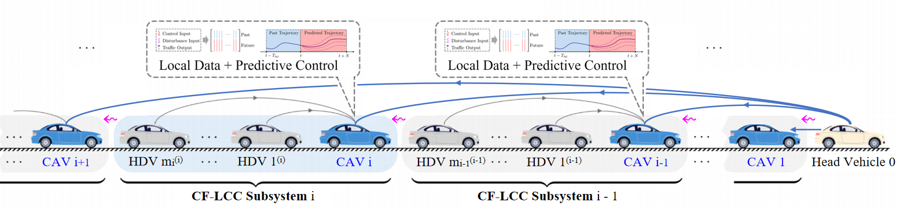

# Decentralized DeeP-LCC
In this project, we present a decentralized DeeP-LCC for control of the Connected and Autonomous Vehicles(CAVs) in mixed traffic. This repository contains the MATLAB scripts for reproducing the experiments in our paper and for further development.

## Decentralized Data-EnablEd Predictive Leading Cruise Control(Decentralized DeeP-LCC)
DeeP-LCC is a data-driven predictive control strategy for CAVs in mixed traffic, where human-driven vehicles(HDVs) also exist. It aims to deal with unknown nonlinear car-following behaviors of HDVs and has been validated in real world small-
scale experiments. However, due to the centralized setting, it is non-trivial for a central unit to collect data and compute control inputs within the sampling period when the scale of the mixed traffic system becomes large.  

To address this problem, we developed the decentralized DeeP − LCC for CAVs in mixed traffic flow. The entire mixed traffic system could be naturally divided into n subsystems, each representing a small mixed traffic system with one CAV *i* and its following *mi* HDVs. Each CAV’s decentralized controller only uses information from **its corresponding subsystem, the preceding vehicle and the head vehicle** to compute its individual input and mitigate the traffic waves. Coupling constraints between subsystems are modeled as **disturbance** and handled through robust optimization by estimating the bound of the disturbance.

<figure>
  
<figure>

Mixed Traffic System

Related projects: 
1. [DeeP-LCC](https://github.com/soc-ucsd/DeeP-LCC)
2. [Distributed DeeP-LCC](https://github.com/wangjw18/Distributed-DeeP-LCC)
3. [Mixed-traffic](https://github.com/soc-ucsd/mixed-traffic)
4. [Leading Cruise Control (LCC)](https://github.com/soc-ucsd/LCC)
5. [Experimental Validation of DeeP-LCC for Dissipating Stop-and-Go Waves in Mixed Traffic](https://www.researchgate.net/profile/Yang-Zheng-24/publication/359865166_Implementation_and_Experimental_Validation_of_Data-Driven_Predictive_Control_for_Dissipating_Stop-and-Go_Waves_in_Mixed_Traffic/links/62539f62cf60536e2353c4ab/Implementation-and-Experimental-Validation-of-Data-Driven-Predictive-Control-for-Dissipating-Stop-and-Go-Waves-in-Mixed-Traffic.pdf)

## Optimization Formulation

The decentralized DeeP-LCC is formed as a robust optimization problem and is implemented in a receding horizon manner.

## Dependency
The code requires the installation of [Mosek](https://www.mosek.com/)

## Instruction
Files `main_sin_brake_simulation.m` and `main_nedc_simulation.m` are used to simulate three different scenarios(sinusoidal pertubation, NEDC, Braking) and controllers with different formulation and disturbance estimation methods are in the folder `_fcn/Decentralized_DeeP_LCC`.
Currently, `main_sin_brake_simulation.m` and `main_nedc_simulation.m` are ready to run for reproducing results in our paper(add paper link).To use it for the mixed traffic system with different formulations, please:

Note: _Check the variable `ID` in each file used to make sure it corresponds to your formulation_
1. Define and generate parameters for HDVs via `data_generation/data_hdvParameter`;
2. Collect trajectory data for the mixed traffic system from `data_generation/data_trajectoryDataCollection`;
3. Choose proper simulation files, perturbation type and controllers to run the simulation 

# Contact us
To contact us about decentralized DeeP-LCC, email either [Xu Shang](mailto:x3shang@ucsd.edu?Subject=Decentralized-DeeP-LCC) or [Yang Zheng](mailto:zhengy@eng.ucsd.edu?Subject=Decentralized-DeeP-LCC).

